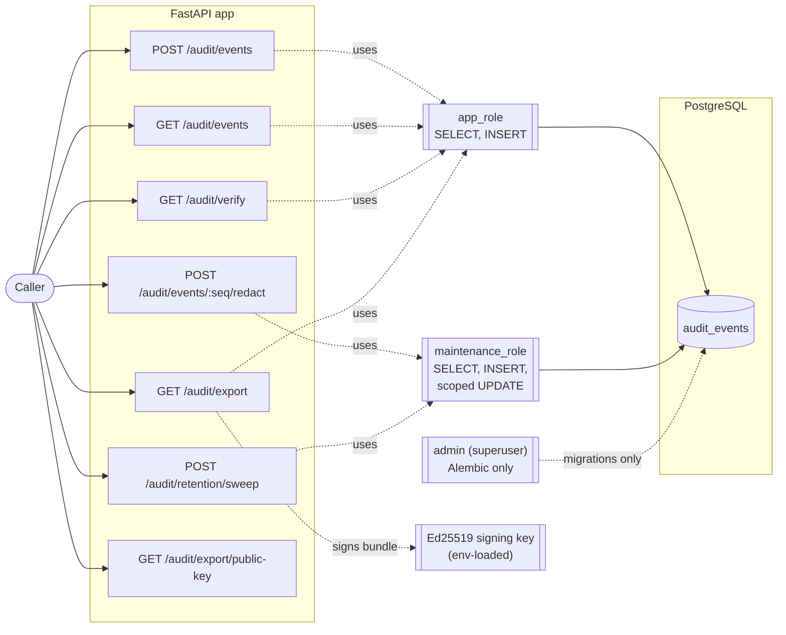

# Architecture

This is a synthesized, reviewer-facing overview. Every decision summarized here has
its full rationale, rejected alternatives, and accepted trade-offs in
[`REQUIREMENTS.md`](REQUIREMENTS.md) — this document links into it rather than
duplicating it, so the two can't drift out of sync.

## Overview

A tamper-evident audit log service: an append-only history of events, chained by
hash so that any modification to a past record — whether through the API or a
direct datastore mutation — is detectable. Built across three scenarios: the core
log (write, query, verify), retention and redaction extensions, and a compliance-
reporting use case satisfied by reusing the same infrastructure rather than adding
new surface area.

## Components

- **FastAPI app** — the API surface (below), organized as one router per concern
  (`api/events.py`, `api/verify.py`, `api/redact.py`, `api/retention.py`,
  `api/export.py`), each backed by a same-named service module holding the actual
  logic (`services/*.py`). Routers stay thin: validation + wiring only.
- **PostgreSQL** — single table (`audit_events`), no other persistent state.
- **Three DB roles**, not one — see [Security model](#security-model).
- **Ed25519 signing key** — used only by the export endpoint; see
  [`REQUIREMENTS.md`](REQUIREMENTS.md) Scenario B item 5c.

## Data model

One table, `audit_events` (`src/audit_log_service/models/audit_event.py`):

| Column | Type | Notes |
|---|---|---|
| `sequence_number` | `BIGINT`, PK | App-computed, gapless, never a DB `SERIAL` — see 7c |
| `event_type` | `TEXT`, nullable | Nulled on archival |
| `actor_id` | `TEXT`, nullable | Nulled on archival |
| `resource_type` | `TEXT`, nullable | Nulled on archival |
| `resource_id` | `TEXT`, nullable | Nulled on archival |
| `payload` | `JSONB`, nullable | Caller-supplied structured detail; nulled on archival |
| `payload_field_commitments` | `JSONB`, nullable | `{field: {hash, salt}}` — see [Hash chain design](#hash-chain-design) |
| `timestamp` | `TIMESTAMPTZ`, nullable | Caller-supplied "when it happened"; nulled on archival |
| `recorded_at` | `TIMESTAMPTZ`, nullable | Server-assigned ingestion time; nulled on archival |
| `content_hash` | `CHAR(64)`, **never null** | Permanent — see below |
| `prev_hash` | `CHAR(64)`, **never null** | Permanent — see below |
| `archived` | `BOOLEAN`, **never null** | Default `false` |
| `archived_at` | `TIMESTAMPTZ`, nullable | Set on archival |

Every column except `sequence_number`/`content_hash`/`prev_hash`/`archived` is
nullable *by design*: retention (Scenario B) nulls the detail columns on archival
while the chain-integrity fields survive forever — see
[`REQUIREMENTS.md`](REQUIREMENTS.md), Scenario B, "Mechanism."

Indexes: `actor_id`, (`resource_type`, `resource_id`), `event_type`, `timestamp` —
one per query filter (4a–4c).

## API surface

| Method | Path | Role | Purpose |
|---|---|---|---|
| `POST` | `/audit/events` | `app_role` | Append an event (req 1, 2) |
| `GET` | `/audit/events` | `app_role` | Filtered, cursor-paginated query (4a–4c, 5a–5c) |
| `GET` | `/audit/verify` | `app_role` | Walk the chain, report intact/first break (req 8) |
| `POST` | `/audit/events/{sequence_number}/redact` | `maintenance_role` | Redact one payload field (Scenario B 3) |
| `POST` | `/audit/retention/sweep` | `maintenance_role` | Archive records past the retention window (Scenario B 1, 2) |
| `GET` | `/audit/export` | `app_role` | Signed, self-contained bundle for a resource/actor (Scenario B 5, Scenario C) |
| `GET` | `/audit/export/public-key` | — | Fetch the export signing public key |
| `GET` | `/health` | — | Liveness |

No update or delete route exists anywhere in this API — append-only is enforced at
the interface boundary (req 2), not just by convention.

## Hash chain design

The core guarantee: modifying any past record invalidates its own hash *and every
hash that follows it*. Three layers, each solving a distinct problem:

1. **`content_hash`** — SHA-256 over a canonical JSON serialization of everything
   the record contains except `prev_hash` itself: `sequence_number`, `recorded_at`,
   `event_type`, `actor_id`, `resource_type`, `resource_id`, `timestamp`, and a
   `payload_commitment`. Covers server-assigned fields too, not just caller input —
   a direct-datastore resequencing attempt is just as detectable as a payload edit.
   ([6a–6c](REQUIREMENTS.md))

2. **`payload_commitment`** — `payload` is *not* hashed as one flat blob. Each
   top-level field gets its own salted commitment
   (`SHA256(salt || field || value)`), and the commitment is a hash over the *set*
   of per-field hashes. This is what makes field-level redaction possible without
   destroying tamper-evidence for the rest of the record: a flat hash is an
   all-or-nothing commitment, so redacting one field would make every other field
   in that payload permanently unverifiable too. ([Scenario B, 3a](REQUIREMENTS.md))

3. **`recordHash` (derived, never stored)** — `SHA256(content_hash || prev_hash)`.
   This is the value the *next* record's `prev_hash` actually points to. Without
   it, `prev_hash` could be rewritten in isolation without affecting `content_hash`,
   letting an attacker forge a two-record change that leaves everything downstream
   valid — which would violate the append-only guarantee's own literal wording.
   Folding `prev_hash` into the propagated value makes every downstream record's
   hash depend on it, so covering up a change requires re-forging the entire rest
   of the chain. ([6d](REQUIREMENTS.md))

**Genesis:** the first record's `prev_hash` is a fixed sentinel, `"0"×64` — chosen
because a genuine SHA-256 output is practically never all-zero. ([7b](REQUIREMENTS.md))

**Verification** (`services/verify.py`) walks the chain in `sequence_number` order,
fail-fast, checking three things per record — genesis (record 1 only), content
(skipped for archived records, which trust their permanently-fixed `content_hash`),
and link (compared against the actual predecessor's `recordHash`, with a gap
sub-classification naming missing `sequence_number`s rather than a fourth,
redundant violation category). Three violation types, not four — see
[8a](REQUIREMENTS.md) for why a separate gap check was considered and rejected.

## Concurrency

All chain appends (writes, redaction's audit event, retention's audit event) go
through one Postgres advisory lock (`pg_advisory_xact_lock`), serializing the
critical section: read tail → compute `sequence_number`/`prev_hash` → insert. Chosen
over `SELECT ... FOR UPDATE` on the tail row specifically because it also covers the
empty-table genesis case, which a row lock can't. `sequence_number` is
application-computed, not a DB `SERIAL`, so an aborted transaction never burns a
value — a gap in the sequence can only mean tampering, never a benign retry.
([7c](REQUIREMENTS.md))

## Security model

Three distinct Postgres roles, not one shared connection:

- **`app_role`** (`SELECT`, `INSERT` only) — what the running application actually
  connects as for writes, queries, verify, and export. No `UPDATE`/`DELETE`/DDL,
  ever.
- **`maintenance_role`** (`SELECT`, `INSERT`, and `UPDATE` scoped to specific
  columns via Postgres column-level grants) — used only by redaction and retention.
  Explicitly excludes `sequence_number`, `content_hash`, `prev_hash` — those three
  columns are never updatable by anything, including this role.
- **Admin/superuser** — used only by Alembic migrations, never reachable from
  application runtime code.

This gives two layers of defense against two different threats: an application bug
or injection is prevented outright (the credentials physically can't issue the
operation); a privileged actor with direct database access can't be stopped by a
role grant, which is exactly the scenario the hash chain exists to *detect* instead.
([2a](REQUIREMENTS.md))

## Known architectural limitations

Full list with rationale in [`REQUIREMENTS.md`](REQUIREMENTS.md); the structurally
significant ones:

- **No external anchoring.** The hash chain proves internal consistency — it cannot
  by itself prove nothing has been tampered with by an attacker willing to rewrite
  the entire chain tail consistently (recompute every downstream hash). Closing
  this gap needs periodic external checkpointing, out of scope here. ([6d/8a](REQUIREMENTS.md))
- **Fully serialized appends.** One global chain means one write at a time,
  system-wide — an accepted consequence of the single-chain decision, not
  something layered on top for this prototype. ([7a](REQUIREMENTS.md))
- **Archived records become unreachable via export filters** once their
  classification fields are nulled — a cross-feature interaction discovered during
  implementation, documented rather than fixed. ([Scenario B, 5e](REQUIREMENTS.md))

See [`TESTING.md`](TESTING.md) for coverage and testing-specific limitations, and
[`ENGINEERING_SUMMARY.md`](ENGINEERING_SUMMARY.md) for the overall risk posture.
